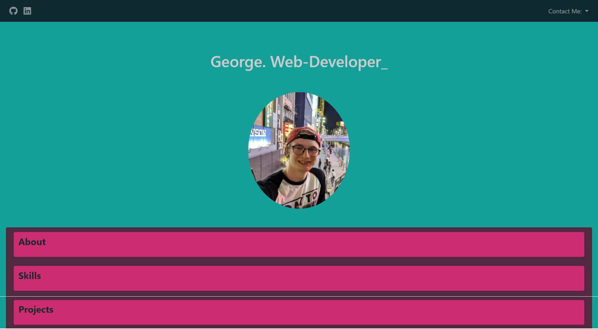
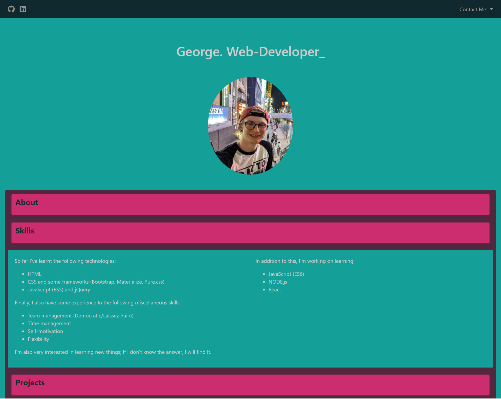
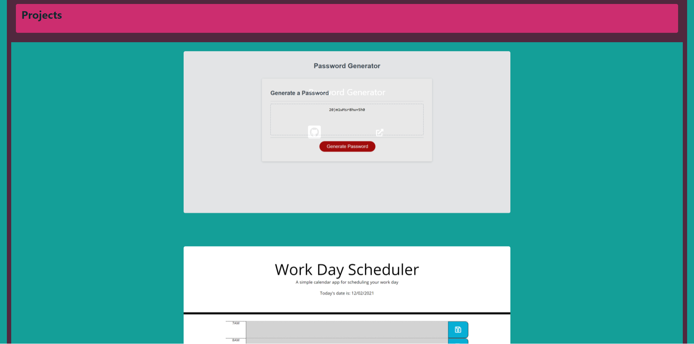

# UoB_BC_Portfolio

## Introduction
Similar to the last version of my portfolio the idea behind this project was to showcase my development in HTML and CSS, and web development 
in general by showcasing projects done thus far.
This version includes links to my updated GitHub & LinkedIn profiles as well as methods for people to contact me.

### Technologies Used
I implemented HTML, CSS and BootStrap 4.6 in this project.

#### Changes Made Since Previous Version
For the most part, changes made were cosmetic, i played around with colours a lot more and used some more advanced CSS concepts such as animations which was a lot of fun.

##### Struggles & Complications
I encountered a few issues during the development process:
1) Responsiveness - this project highlighted to me that i still need to put in a lot of work to fully understand responsive design and be able to include it in further projects.
2) Colours - being colour blind is hard basically. I struggled a great deal trying to put together a colour pallete that didn't look off in one way or another. Most of the feedback
             i got regarding my choice of colours came from family members. In the end i chose to look up a colour pallete that someone else had put together and did my best to 
             utilise it in an appealing way.
3) Bootstrap - altering the default colours and styling of bootstrap components seems to me to be rather complicated. One method which was suggested on the Bootstrap website was to
               download bootstrap, edit all the default colours in the bootstrap.css file, delete anything else and include in below the CDN for Bootstrap as a means of ensuring
               Bootstrap is up to date but also overwriting the default colours via the edited bootstrap.css file. This seemed like a hell of a lot of work, although doing it
               would have made it easier to update colour palettes in the future as i would already have a template bootstrap.css files with all irelevant style rules removed, 
               instead i opted to use the !important directive to overwrite default styling. Whilst i understand that this isn't best practice it worked as a solution for this
               particular project. 
4) Styling - this point ties into the last one but i think of it as a seperate problem altogether. The default Bootstrap components server their purpose and they're fantastic in 
             that regard. However, i feel they look fairly plain and generic, i would have liked to be able to customise some of the componenets to suit my liking a bit more. This
             would have involved something similar to the solution in point 3 but would have been far more time consuming. 
             In the future i will consider utilising different frameworks to get a more unique style, or create my own components. 
             
###### For the Future
Like i've already said, in the future i will consider utilising other CSS frameworks. I would also like to implement JavaScript into the portfolio to make it more interactive.

###### Screenshots & Link to Deployed Site

https://mydryday.github.io/UoB_BC_Portfolio/
